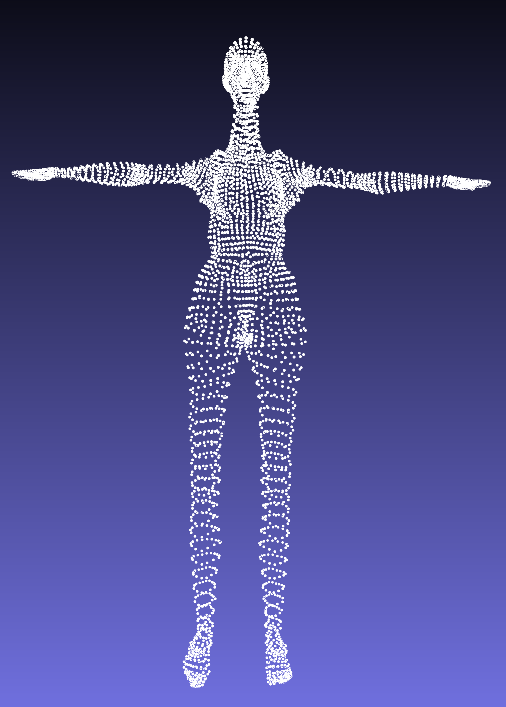

# SMPL
SMPL: A Skinned Multi-Person Linear Model implemented in C++ following the [paper](https://files.is.tue.mpg.de/black/papers/SMPL2015.pdf) published by Max Planck Institute for Intelligent Systems on SIGGRAPH ASIA 2015.
The official SMPL model is available at http://smpl.is.tue.mpg.de.

## Prerequisites
1. [Eigen](https://eigen.tuxfamily.org/index.php?title=Main_Page) - a C++ template library for linear algebra.
2. [Ceres](http://ceres-solver.org/) - a library for modeling and solving optimization problems.
3. [CMake](https://cmake.org/download/) - to build the project.

## Data Preprocessing
1. Download and extract the official models from http://smpl.is.tue.mpg.de/ under ``./Data/``. You should have the following files:
```
basicModel_f_lbs_10_207_0_v1.0.0.pkl
basicmodel_m_lbs_10_207_0_v1.0.0.pkl
```
2. Run ``extract_model_param.py`` with Python 2 to convert the data into ``.json`` and ``.npz`` format and save it under ``./Data/``:
```
python2 extract_model_param.py -g female -m './Data/basicmodel_f_lbs_10_207_0_v1.0.0.pkl' --save_dir './Data/'
```
If you choose a different directory to save the data, make sure to specify the correct paths in ``main.cpp``.

## Usage
Specify the desired beta and theta parameters in the ``./Data/blend_shapes`` file. The first 10 values represent the beta and the next 23*3 values - the theta. The beta parameters represent the coefficients that determine the shape of the body. By adjusting these parameters, you can generate different body shapes, such as slim, muscular, or obese, within the model. The theta parameters define the rotation of each joint in the body, allowing the model to be posed in different configurations. Adjusting theta parameters changes the pose of the body, enabling it to take various positions. After building the project, you will have an executable program called ``smpl``. Run it as follows to obtain the model point cloud consisting of 6890 3D points:
```
./smpl ./Data/blend_shapes 
```
To obtain only the joints, use the following:
```
./smpl ./Data/blend_shapes -r
```
Option -h shows the usage manual.
```
./smpl -h
```

## Results
The images below illustrate several outcomes following adjustments to the beta and theta parameters.
<div style="display: flex;">
    
    
</div>
